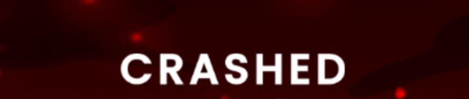
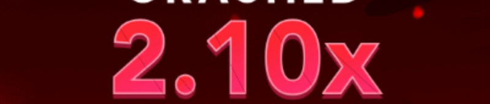

# BOT SPACEMAN
O BOT SPACEMAN é um projeto de Web Scraping focado no jogo Spaceman. Embora o jogo use um elemento Canvas dificultando a extração direta, este projeto adota uma abordagem criativa. Capturando screenshots do navegador e usando reconhecimento ótico de caracteres (OCR), ele extrai dados mais importantes do jogo.

# Funcionamento
1. Puppeteer: Carrega a página do jogo e captura screenshots em sequência.
2. Pré-processamento: Melhora a qualidade das imagens com redução de ruído e aumento de contraste.
  * 
  * 
  * 
  * 
1. Tesseract: Converte texto nas imagens em dados legíveis.
2. Análise: Determina resultados das partidas (VITÓRIA, EMPATE, DERROTA).

# Dependências
- puppeteer: Controle de navegador.
- puppeteer-stealth: Evita detecção automatizada.
- telegraf: Framework para bots de Telegram.
- tesseract: Extração de texto de imagens.
- jimp: Processamento de imagens em JavaScript.

# Observações
A lógica de VITÓRIA/EMPATE/DERROTA é definida por uma função geral, podendo ser otimizada. Para depuração, a flag mostra o navegador Puppeteer. Uma pasta armazena imagens processadas.

# Contribuições
Contribuições são bem-vindas! Sinta-se à vontade para abrir problemas e solicitações de pull.

Divirta-se!